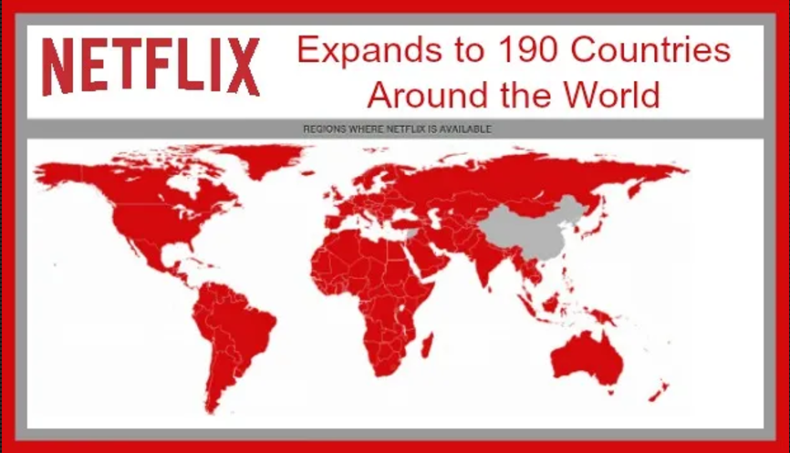

# 🎬 Netflix Data Analysis



An exploratory data analysis (EDA) project on Netflix movies dataset using Python.

---

## 📊 Dataset

| Field | Details |
|---|---|
| Source | TMDB Movie Database |
| File | `mymoviedb.csv` |
| Rows | 9,827 |
| Columns | 9 |

**Columns:** `Release_Date` `Title` `Overview` `Popularity` `Vote_Count` `Vote_Average` `Original_Language` `Genre` `Poster_Url`

---

## 🛠️ Tech Stack


---

## 📁 Project Structure

```
Netflix-Data-Analysis/
│
├── data/
│   └── mymoviedb.csv
│
├── notebooks/
│   └── movie data analysis netflix.ipynb
│
├── images/
│   └── netflix.png
│
└── README.md
```

---

## 🔍 Analysis Questions

| # | Question |
|---|---|
| Q1 | What is the most frequent genre in the dataset? |
| Q2 | What genres have the highest votes? |
| Q3 | Which movie has the highest popularity and what is its genre? |
| Q4 | Which movie has the lowest popularity and what is its genre? |
| Q5 | Which year had the most filmed movies? |

---

## 💡 Key Findings

- 🎭 **Drama** is the most frequent genre, appearing **14%+** of the time across 19 genres
- 🕷️ **Spider-Man: No Way Home** (2021) has the highest popularity score of **5083.95** — Genres: Action, Adventure, Science Fiction
- 🎵 **The United States vs. Billie Holiday** (2021) has the lowest popularity score of **13.35** — Genres: Music, Drama, History
- 📅 **2020** had the highest number of movies released in the dataset
- ⭐ **25.5%** of movies fall in the popular vote category, dominated by Drama

---

## 🧹 Data Cleaning Steps

1. Loaded CSV using `lineterminator='
'` to fix Buffer Overflow parsing error
2. Converted `Release_Date` to datetime and extracted year only
3. Dropped unnecessary columns — `Overview`, `Original_Language`, `Poster_Url`
4. Categorized `Vote_Average` into 4 tiers using quartile-based binning:
   - `not_popular` `below_avg` `average` `popular`
5. Split and exploded `Genre` column for accurate genre-level analysis
6. Dropped NaN rows created after `pd.cut()`

---

## 📈 Visualizations

### Genre Distribution
> Drama is the most dominant genre across the dataset

### Vote Average Distribution
> Average and popular votes are nearly equally distributed

### Release Year Histogram
> Content production peaked around 2020

---

## 🚀 How to Run

**1. Clone the repository:**
```bash
git clone https://github.com/VK-learner/Netflix-Data-Analysis.git
```

**2. Mount Google Drive in Colab:**
```python
from google.colab import drive
drive.mount('/content/drive')

import os
os.chdir('/content/drive/MyDrive/Colab Notebooks/Netflix-Data-Analysis')
```

**3. Install dependencies:**
```bash
pip install pandas numpy matplotlib seaborn
```

**4. Load the dataset:**
```python
import pandas as pd
df = pd.read_csv('data/mymoviedb.csv', lineterminator='
')
df.head()
```

**5. Open and run the notebook:**
```
notebooks/movie data analysis netflix.ipynb
```

---

## 📦 Dependencies

```
pandas
numpy
matplotlib
seaborn
```

---

## 🤝 Contributing

Pull requests are welcome! For major changes, please open an issue first to discuss what you would like to change.

---

## 📄 License

This project is open source and available under the [MIT License](LICENSE).

---

## 👤 Author

**VK-learner**

[](https://github.com/VK-learner)
[](https://www.linkedin.com/in/YOUR-LINKEDIN-URL)

---

*⭐ If you found this project helpful, please give it a star!*